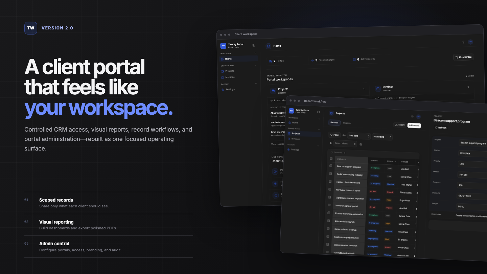
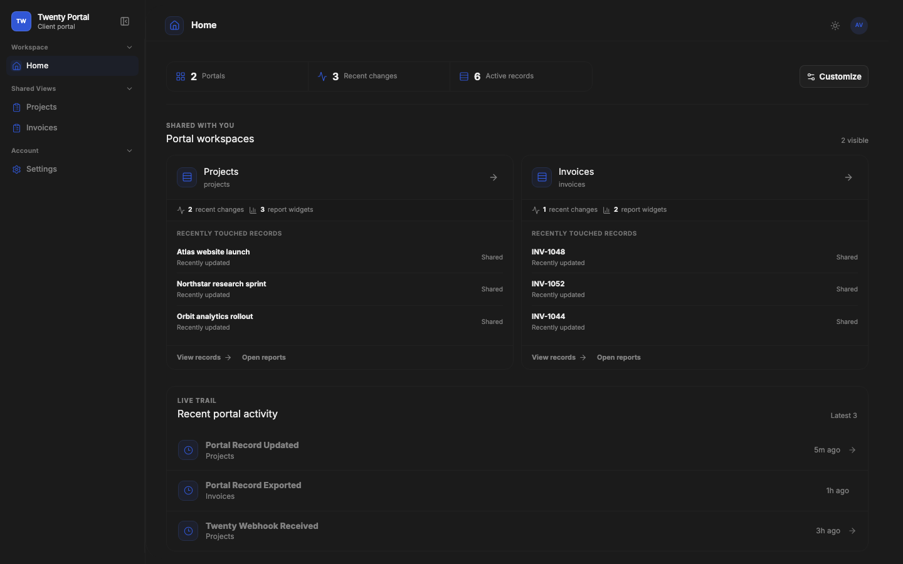
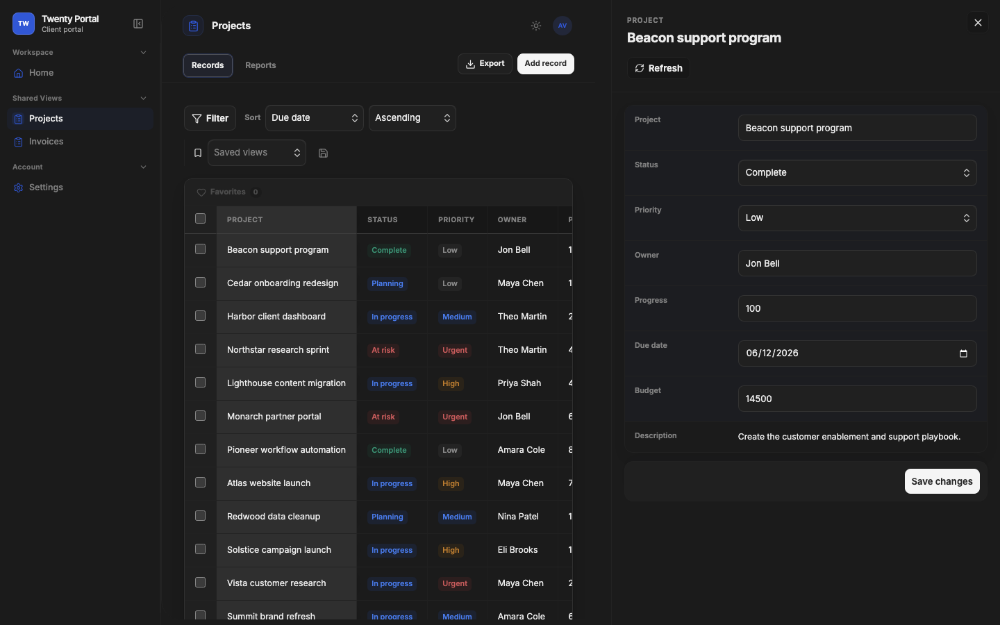
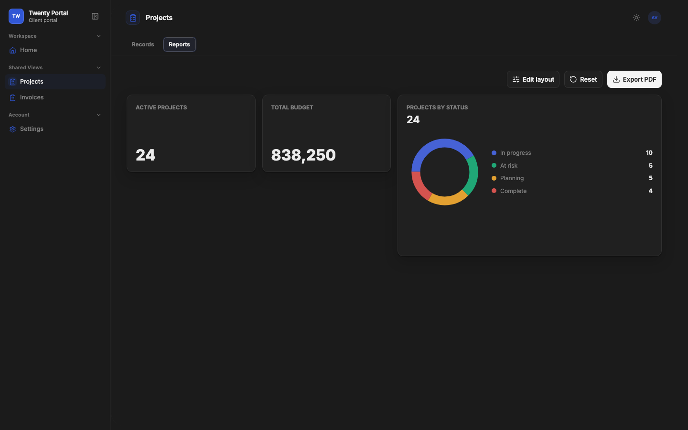
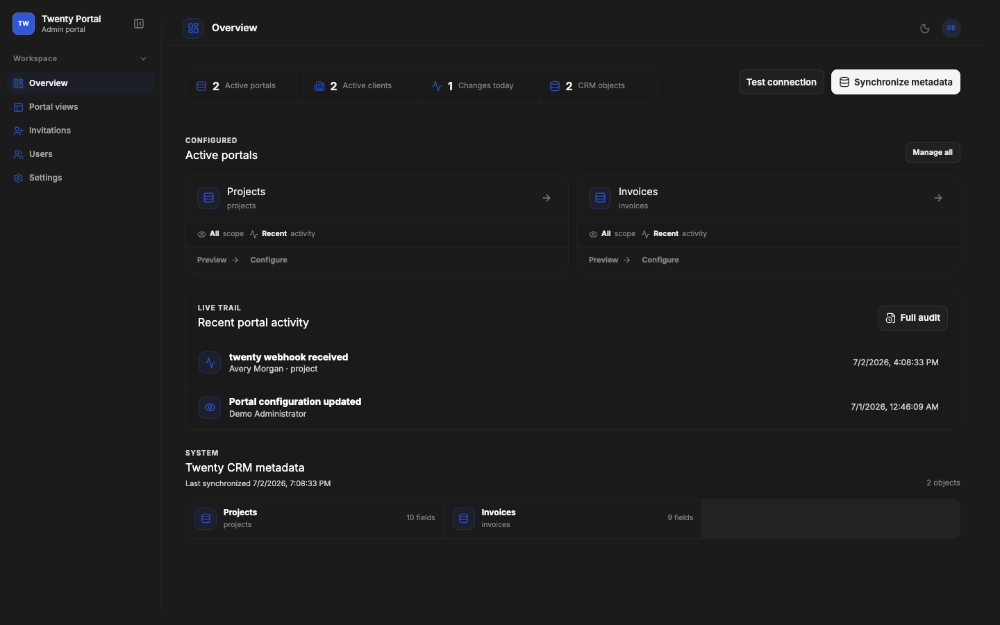
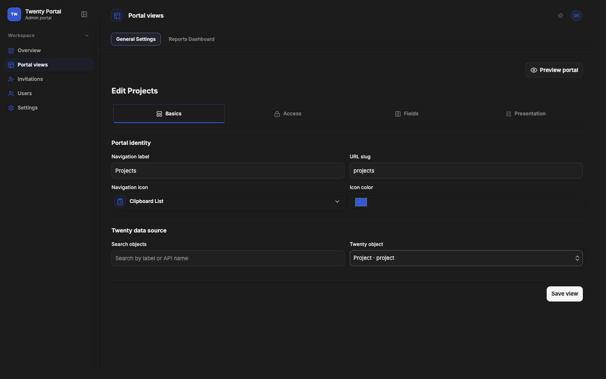
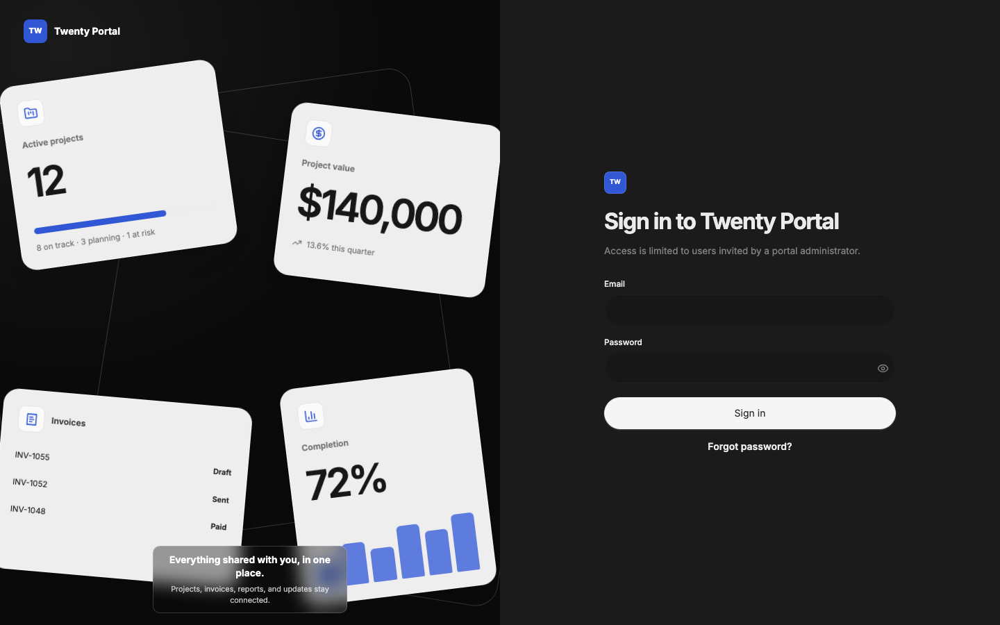
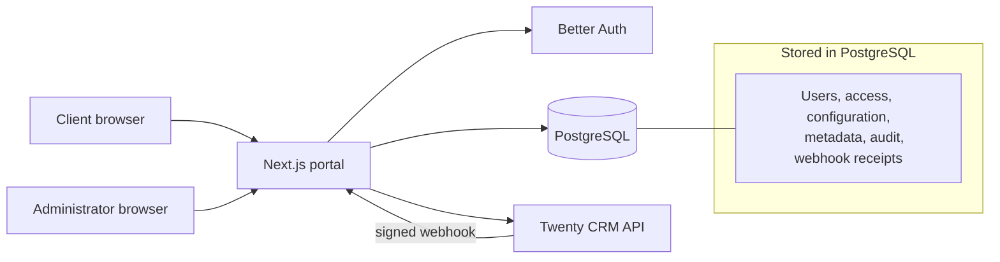

<div align="center">

# Twenty CRM Client Portal

### A self-hosted client workspace for sharing the right Twenty CRM records with the right people.

Invite clients, publish scoped record views, build visual reports, and manage the entire experience without exposing your CRM credentials or internal workspace.

[Quick start](#quick-start) · [Product tour](#product-tour) · [Configuration](#configuration) · [Security](#security-model) · [Release guide](RELEASING.md)

**Version 2.0** · Next.js 16 · PostgreSQL 17 · Node.js 22

</div>



## The portal layer between your CRM and your clients

Twenty remains the system of record. This application provides the controlled,
client-facing layer around it: authentication, authorization, portal
configuration, record scoping, dashboards, exports, and audit history.

Version 2.0 rebuilds both the client and administrator experiences around one
shared workspace system. Navigation, tables, side panels, forms, reports, and
settings now behave consistently across the application.

| Client experience | Administrator control |
| --- | --- |
| Branded, invite-only authentication | Configure multiple portal views from Twenty metadata |
| Scoped record tables, details, create, and edit flows | Assign view-specific roles, icons, colors, and permissions |
| Sorting, filtering, saved views, favorites, and bulk edits | Manage users, clients, invitations, SSO, SMTP, and branding |
| Configurable dashboards and PDF/CSV/XLSX exports | Audit portal activity and monitor deployment health |

## Product tour

### A focused client home

Clients arrive at a concise overview of their available workspaces, recent
records, reporting activity, and the actions shared with them.



### Records stay in context

The first columns remain anchored while horizontal tables scroll. Selecting a
record opens a resizable detail panel without navigating away from the list.
Contributors can edit one record or apply a validated field update to multiple
selected records.



### Reports are part of the portal

Build number, bar, donut, and secure embedded widgets from scoped CRM data.
Users can rearrange their view and export a customizable, print-ready PDF.



### Administration uses the same design language

The administrator portal provides metadata status, portal health, recent
activity, access management, and direct paths into each configured workspace.



### Portal configuration is visual and metadata-aware

Choose the object, record scope, fields, permissions, forms, navigation icon,
icon color, reports, and layout for every published portal view. Configuration
is continuously checked against synchronized Twenty metadata.



### A branded entry point

The sign-in experience supports application branding, a custom background,
password visibility controls, password reset, and optional SSO providers.



## Core capabilities

- **Invite-only access** with administrator, viewer, and contributor roles.
- **Multiple portal assignments** with independent permissions per user and
  portal view.
- **Three record scopes:** all matching records, authenticated Person scope, or
  an explicit record allowlist.
- **Metadata-driven interfaces** for tables, details, filters, create forms,
  edit forms, select options, and validation.
- **Record workflows** with sticky identity columns, right-click actions,
  multi-select, bulk edit, favorites, saved views, notes, and attachments.
- **Reports and exports** with configurable dashboard widgets, secure HTTPS
  embeds, CSV/XLSX export, and an editable PDF preview.
- **Application identity** with brand name, logo, login artwork, primary color,
  icon color, portal copy, and user avatars.
- **Authentication options** through credentials, Google, or a custom
  OAuth/OpenID Connect provider. SSO remains invite-only.
- **Operational safety** through metadata validation, signed and deduplicated
  webhooks, audit logging, readiness checks, and non-root containers.
- **Demo mode** with repeatable projects, invoices, users, configuration, and
  activity for local evaluation without a Twenty instance.

## How it works



Every client record read or mutation resolves the authenticated portal view,
applies its configured scope and fixed filters, validates the requested fields,
and records permitted writes in the audit trail. The Twenty API key never
reaches the browser.

## Quick start

### Requirements

- Docker Engine with Docker Compose
- A Twenty workspace and restricted API key for production use
- SMTP credentials if the portal should deliver invitation emails

### Run with Docker Compose

```bash
git clone https://github.com/lilremark/twentycrmclientportal.git
cd twentycrmclientportal
cp .env.example .env
```

Set at least these values in `.env`:

```env
POSTGRES_PASSWORD=replace-with-a-strong-database-password
APP_URL=https://portal.example.com
TRUSTED_ORIGINS=https://portal.example.com
AUTH_SECRET=replace-with-at-least-32-random-characters
TWENTY_BASE_URL=https://your-workspace.twenty.com
TWENTY_API_KEY=replace-with-a-restricted-api-key
TWENTY_WEBHOOK_SECRET=replace-with-the-webhook-signing-secret
```

Start the pinned 2.1 release:

```bash
PORTAL_VERSION=2.1.1 docker compose up -d
docker compose ps
curl --fail http://localhost:3005/health/ready
```

Open `http://localhost:3005/setup` to create the first administrator. Initial
setup remains available only while no administrator exists. Migrations run
automatically when the portal container starts.

### Evaluate with demo data

Demo mode replaces Twenty API reads and writes with a repeatable local dataset.
It is intended for local evaluation only.

```env
APP_URL=http://localhost:3005
TRUSTED_ORIGINS=http://localhost:3005
DEMO_MODE=true
SYSTEM_ADMIN_NAME=Demo Administrator
SYSTEM_ADMIN_EMAIL=admin@example.test
SYSTEM_ADMIN_PASSWORD=TestAdmin!2026
```

```bash
docker compose up -d
```

The seeded client account is:

```text
Email:    client@example.test
Password: TestClient!2026
```

## Configuration

The complete template is documented in [`.env.example`](.env.example). These
are the variables most deployments need to review:

| Variable | Purpose |
| --- | --- |
| `DATABASE_URL` | PostgreSQL connection used by the portal |
| `APP_URL` | Canonical public portal URL |
| `TRUSTED_ORIGINS` | Additional browser origins accepted by authentication |
| `AUTH_SECRET` | Better Auth signing/encryption secret, at least 32 characters |
| `TWENTY_BASE_URL` | Base URL of the Twenty workspace |
| `TWENTY_API_KEY` | Restricted server-side Twenty API credential |
| `TWENTY_WEBHOOK_SECRET` | Secret used to validate incoming webhook signatures |
| `SMTP_*` | Invitation and password-reset email delivery settings |
| `PORTAL_VERSION` | Docker image tag; defaults to `2.1.1` |
| `DEMO_MODE` | Enables local mock CRM records and demo seeding |

Use `SMTP_SECURE=false` with port `587` or `25` for STARTTLS. Use
`SMTP_SECURE=true` only with port `465` for implicit TLS.

## Local development

The project intentionally targets Node.js 22 and npm 10.9.8.

```bash
npm ci
cp .env.example .env
npm run db:migrate
npm run admin:bootstrap
npm run dev
```

For local demo development:

```bash
DEMO_MODE=true npm run demo:seed
npm run dev
```

Useful commands:

| Command | Purpose |
| --- | --- |
| `npm run lint` | Run ESLint |
| `npm run typecheck` | Validate TypeScript without emitting files |
| `npm run test` | Run the Vitest unit/component suite |
| `npm run test:e2e` | Run Playwright browser tests |
| `npm run build` | Create the production Next.js build |
| `npm run check` | Run lint, typecheck, tests, and build |
| `npm run db:generate` | Generate a Drizzle migration after schema changes |
| `npm run db:migrate` | Apply committed migrations |

## Security model

- Twenty credentials, SMTP credentials, OAuth secrets, and setup credentials
  remain server-only.
- Portal access is recalculated server-side for every record operation.
- Exports rebuild authorization, scope, fixed filters, sorting, and permitted
  columns instead of trusting browser state.
- Bulk updates are capped, rate-limited, and restricted to configured editable
  fields.
- Dashboard embeds require public HTTPS URLs and reject local/private network
  targets and embedded credentials.
- Webhooks are signature-checked, size-limited, and deduplicated.
- The production container runs as a non-root user with all Linux capabilities
  dropped and `no-new-privileges` enabled.

See [SECURITY.md](SECURITY.md) for supported versions and private vulnerability
reporting.

## Operations

### Backup PostgreSQL

```bash
docker compose exec postgres \
  pg_dump -U portal -d portal -Fc > portal.dump
```

### Restore PostgreSQL

```bash
docker compose exec -T postgres \
  pg_restore -U portal -d portal --clean < portal.dump
```

### Reset a local deployment

This permanently removes the Compose database volume:

```bash
sh scripts/reset-docker.sh --yes
```

### Recover administrator access

Temporarily set `SYSTEM_ADMIN_NAME`, `SYSTEM_ADMIN_EMAIL`, and
`SYSTEM_ADMIN_PASSWORD`, then recreate the portal container. Remove those
values and recreate the container again after access is restored.

## Project map

```text
drizzle/                 Ordered PostgreSQL migrations and snapshots
public/screenshots/      Product and release documentation images
scripts/                 Migration, bootstrap, demo, and reset utilities
src/app/                 Next.js routes, server actions, and route handlers
src/components/          Portal, admin, report, table, form, and UI components
src/lib/db/              Drizzle schema and database client
src/lib/demo/            Demo Twenty metadata and records
src/lib/twenty/          Server-side Twenty client, metadata, filters, and cache
tests/e2e/               Playwright health and browser coverage
```

## Contributing and releasing

- Read [CONTRIBUTING.md](CONTRIBUTING.md) before changing record access,
  uploads, or Twenty integrations.
- Review [CHANGELOG.md](CHANGELOG.md) for release history and 2.0 upgrade notes.
- Follow [RELEASING.md](RELEASING.md) to keep package, image, Compose, OCI, and
  deployment versions aligned.

## License

See [LICENSE](LICENSE).
